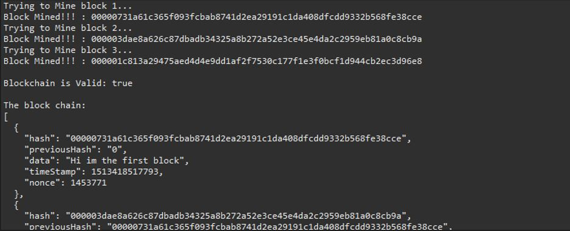
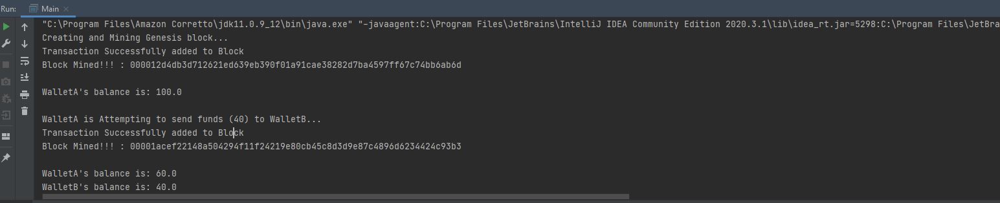

# Blockchain Local Concept

# Overview
This project created a **basic blockchain** which implements basic features such as a **mining system** and **transactions**. This project uses
* **OOP constructs** to efficiently call/manipulate functions
* GSON to turn objects into Json
* Java.security to get access to the **SHA256 cryptographic algorithm** to create hashes & **elliptic-curve** for public/private keys
* Data structure implementation using **arraylists and hashmaps** for efficient data storage
* Use **bounceycastle** as a security provider

# Features
* Mining system
* SHA256 algorithm based hashes for each block
* Difficulty for mining which determines the number of 0's that must be solved for each mined block.
* Block-tampering detection as blockchain checks the prior block's hash and current hash to validate
* Wallet creation with a public and private key created using Elliptic-curve cryptography
* Transactions between wallets with signature verification
* Bounceycastle dependency used as a security provider

